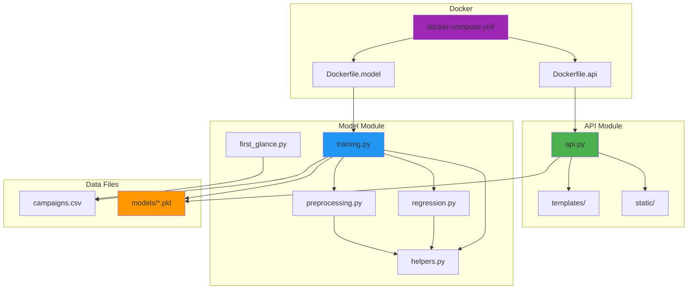
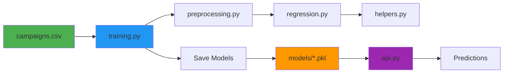
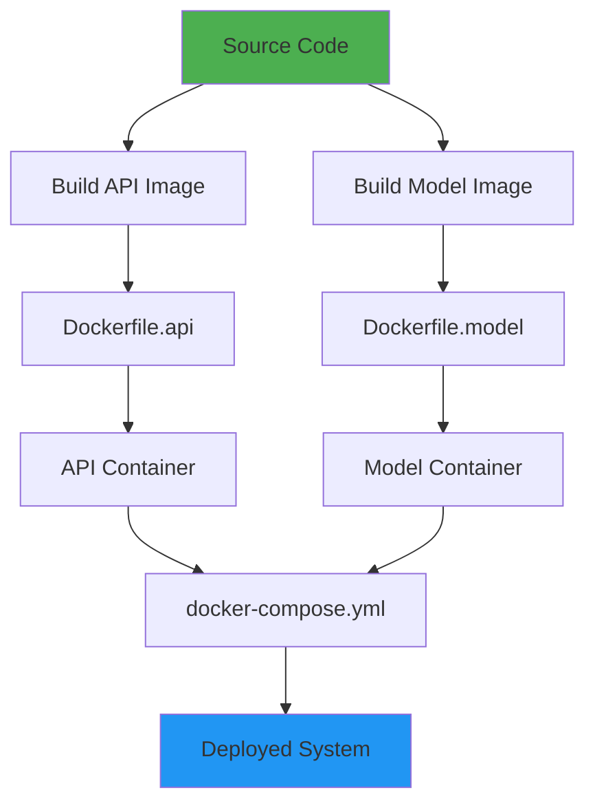

# Project Structure Diagram

## Directory Tree

```
predictor/
│
├── api/                          # Flask Web Application
│   ├── api.py                    # Main Flask application
│   ├── requirements.txt          # Python dependencies
│   ├── templates/                # HTML templates
│   │   ├── base.html
│   │   └── index.html
│   └── static/                  # Static assets
│       └── css/
│           └── custom.css
│
├── model/                        # Machine Learning Components
│   ├── training.py              # Main training pipeline
│   ├── regression.py            # Regression model classes
│   ├── preprocessing.py         # Data preprocessing functions
│   ├── helpers.py               # Helper utilities
│   ├── first_glance.py          # Data exploration
│   ├── transfer.py             # Transfer learning
│   ├── importance.py           # Feature importance
│   ├── campaigns.csv            # Training data
│   ├── impressions.csv         # Impressions data
│   └── models/                  # Trained models storage
│       ├── impressions_model.pkl
│       └── impressions_columns.pkl
│
├── data/                        # Additional data files
│
├── docs/                        # Documentation
│   ├── README.md
│   ├── system-diagrams.md
│   ├── architecture-overview.md
│   └── project-structure.md
│
├── Dockerfile.api               # API container definition
├── Dockerfile.model             # Model training container
├── docker-compose.yml           # Docker orchestration
├── Makefile                     # Build automation
├── .dockerignore                # Docker build exclusions
├── README.md                    # Project README
└── README-Docker.md             # Docker setup guide
```

## Component Relationships



## File Dependencies

### API Module
```
api.py
├── Flask framework
├── Templates (HTML)
├── Static assets (CSS)
└── Model files (.pkl)
    ├── impressions_model.pkl
    └── impressions_columns.pkl
```

### Model Module
```
training.py
├── regression.py
│   └── helpers.py
├── preprocessing.py
│   └── helpers.py
├── helpers.py
└── Data sources
    ├── campaigns.csv
    └── impressions.csv
```

## Data Flow Through Files



## Build and Deployment Flow



## Key Files Description

| File | Purpose |
|-----|---------|
| `api/api.py` | Main Flask application with routes and prediction logic |
| `model/training.py` | Complete ML training pipeline |
| `model/regression.py` | Regression model implementations (Linear, Tree, Forest, SVR) |
| `model/preprocessing.py` | Data cleaning, encoding, and scaling functions |
| `model/helpers.py` | Utility functions for accuracy calculation |
| `Dockerfile.api` | Container definition for API service |
| `Dockerfile.model` | Container definition for training environment |
| `docker-compose.yml` | Orchestration of containers |
| `Makefile` | Build and deployment automation |

## Module Responsibilities

### API Module
- **Purpose**: Serve predictions via web interface and REST API
- **Key Functions**: Request handling, data formatting, model loading, prediction
- **Dependencies**: Flask, pandas, scikit-learn, joblib

### Model Module
- **Purpose**: Train and evaluate ML models
- **Key Functions**: Data preprocessing, model training, evaluation, persistence
- **Dependencies**: pandas, scikit-learn, numpy, xgboost, statsmodels

### Docker Module
- **Purpose**: Containerize and orchestrate services
- **Key Files**: Dockerfiles, docker-compose.yml, Makefile
- **Benefits**: Isolation, reproducibility, easy deployment

