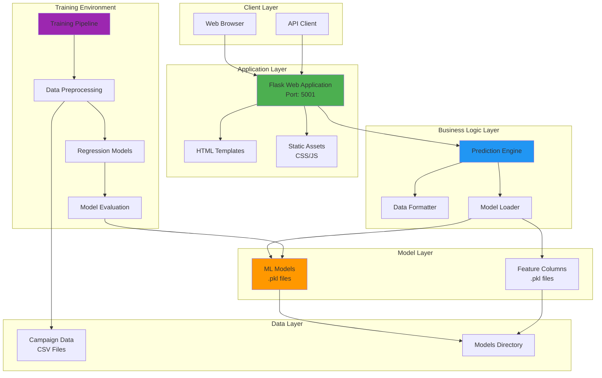
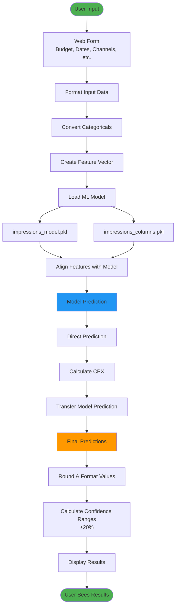
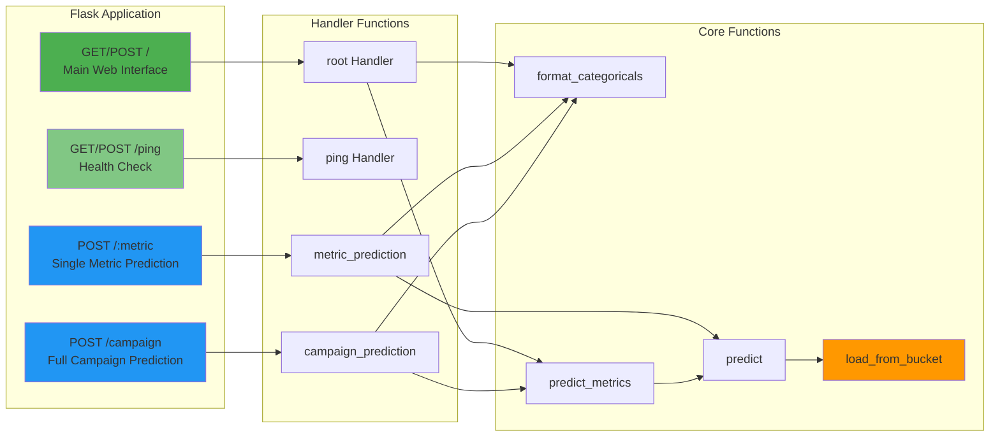
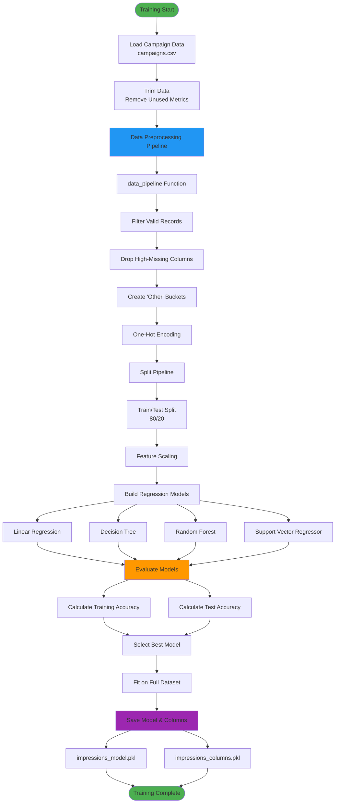
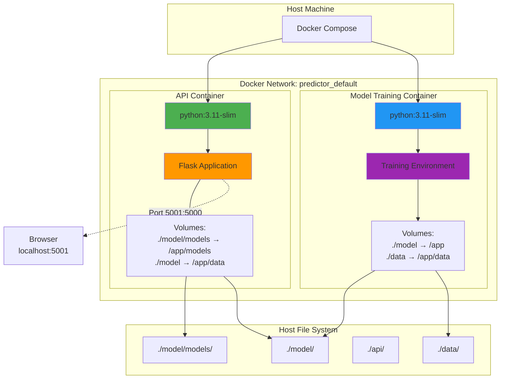
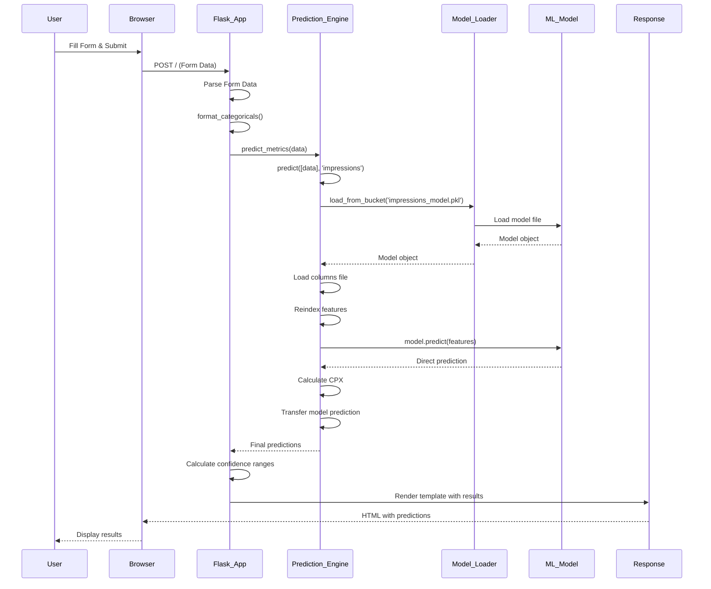
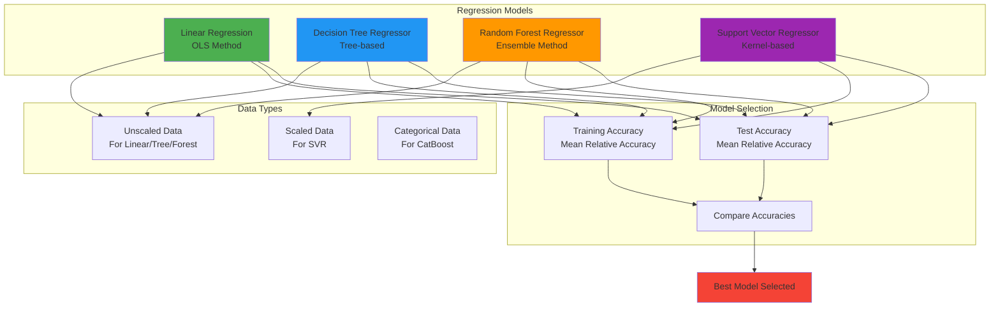
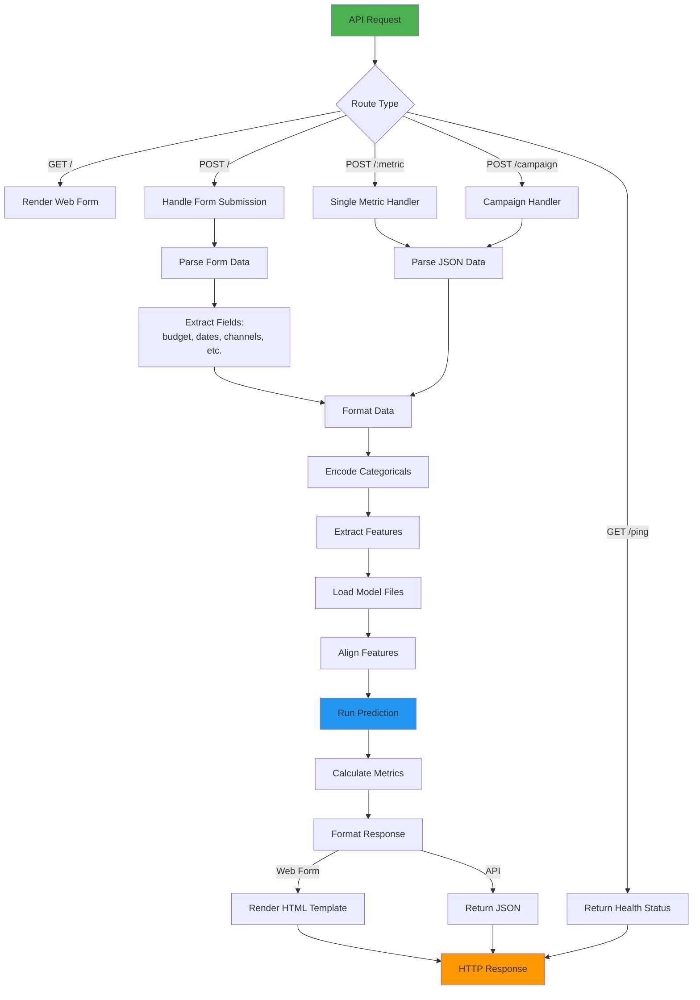
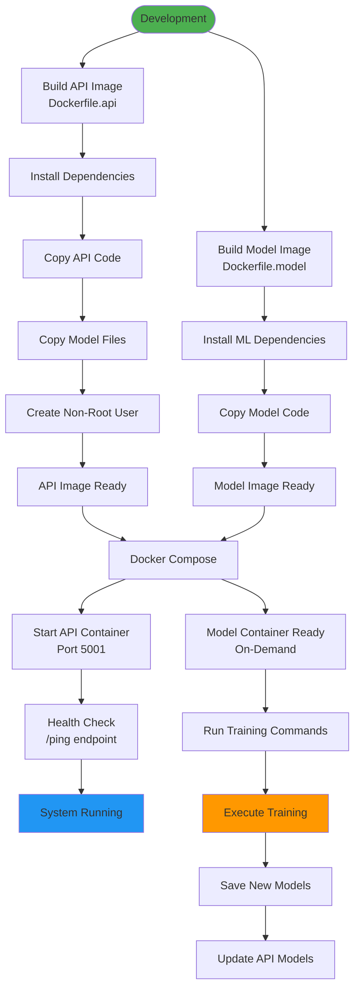

# Marketing Performance Predictor - System Diagrams

This document contains comprehensive system diagrams for the Marketing Performance Predictor project.

## 1. System Architecture Overview

## 2. Data Flow Diagram

## 3. API Endpoints Structure

## 4. Model Training Pipeline

## 5. Docker Deployment Architecture

## 6. Component Interaction Sequence

## 7. Model Types and Evaluation

## 8. Feature Engineering Pipeline

```mermaid
flowchart LR
    Raw_Data[Raw Campaign Data] --> Filter_Valid[Filter Valid Records<br/>output > 0]
    
    Filter_Valid --> Drop_Missing[Drop High-Missing Columns<br/>threshold: 50%]
    Drop_Missing --> Handle_NaN[Drop Rows with NaN]
    Handle_NaN --> Create_Other[Create 'Other' Buckets<br/>threshold: 10%]
    
    Create_Other --> Encode[One-Hot Encoding]
    Encode --> Categorical_Features[Categorical Features<br/>region_*, category_*, shop_*]
    
    Create_Other --> Numerical_Features[Numerical Features<br/>budget, days, weeks, etc.]
    
    Categorical_Features --> Feature_Vector[Final Feature Vector]
    Numerical_Features --> Feature_Vector
    
    Feature_Vector --> Scale[Standard Scaling<br/>For SVR]
    Feature_Vector --> No_Scale[No Scaling<br/>For Tree Models]
    
    Scale --> Scaled_Features[Scaled Features]
    No_Scale --> Unscaled_Features[Unscaled Features]
    
    Scaled_Features --> Model_Input
    Unscaled_Features --> Model_Input[Model Input]
    
    style Raw_Data fill:#4CAF50
    style Feature_Vector fill:#2196F3
    style Model_Input fill:#FF9800
```

## 9. Prediction Request Flow

## 10. System Deployment Flow

## Diagram Legend

- **Green**: Entry/Exit points, successful operations
- **Blue**: Core processing components
- **Orange**: Models and predictions
- **Purple**: Training and evaluation
- **Red**: Critical operations

## Notes

- All diagrams use Mermaid syntax and can be rendered in:
  - GitHub/GitLab markdown
  - VS Code with Mermaid extension
  - Online Mermaid editors
  - Documentation tools that support Mermaid

- The system supports both web interface and REST API access
- Models are trained offline and loaded at runtime
- Docker containers provide isolated environments for API and training
- Model files are shared between containers via volume mounts

